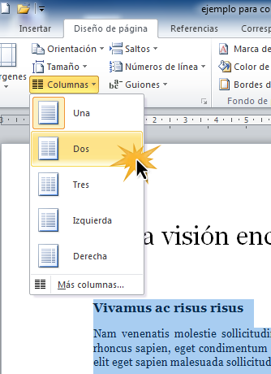
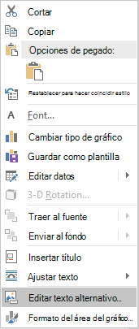

% Documentos Word accesibles
% Eva Muñoz Martín 
% 8 de marzo de 2021

# Objetivo

## Introducción

El objetivo de esta presentación es aportar recomendaciones para crear documentos de Word accesibles para cualquier persona. 

# Criterios de accesibilidad 

## Idioma

Se debe indicar el idioma del documento para que los lectores de pantalla puedan leer correctamente el texto.

## Color

* No se debe usar el color como único medio para transmitir información
* Se debe aplicar un contraste suficiente entre el texto y los colores de fondo

## Estilo

* Se deben usar los títulos y estilos integrados para organizar el documento
* En documentos largos se debe generar un índice de contenidos 

## Estilo de títulos

* Los títulos deben ser descriptivos
* Los encabezados deben diferenciarse unos de otros y usarse en orden:
	1. Título 1
	2. Título 2
	...

## Tipografía

|   Tipo de documento   | Tipografía |Ejemplo                        |
| --------------        | -----------| ------------------------------|
| Impreso               | Serif      | Times New Roman, Georgia      |
| Lectura en pantalla   | Sans serif | Calibri, Verdana              |

## Tipografía 

* Se recomienda usar un tamaño de letra de 12 puntos
* No se recomienda utilizar cursivas ni mayúsculas para enfatizar 
* Se recomienda alinear los textos en el borde izquierdo del documento 

## Espaciado

* Se deben insertar saltos de página en lugar de pulsar ENTER repetidas veces para cambiar de página
* Se deben insertar columnas desde diseño de página y no con espaciado

## Espaciado

## Imágenes

* Hay que acompañar las imágenes con un título y un texto alternativo 
* El texto alternativo debe describir la imagen y su contexto 
* Se debe evitar usar texto informativo en las imágenes

## Tablas

* Se debe utilizar 'insertar tabla' para que los lectores de pantalla las interpreten adecuadamente
* Es recomendable que las tablas no ocupen más de una página
* Las tablas deben tener correctamente definidos los encabezados 

## Hipervínculos

* Deben ir acompañados de texto descriptivo
* Se debe especificar el destino del enlace
* Se deben evitar construcciones como 'haga click aquí'

## Gráficos

* Es recomendable describir el contenido del gráfico
* Se pueden incluir los datos del gráfico en un formato alternativo, por ejemplo: una tabla

## Gráficos

Para insertar texto alternativo debemos pulsar el botón derecho y después 'editar texto alternativo'

# Comprobador de accesibilidad

## Uso de la herramienta 

Para saber si hemos aplicado adecuadamente las técnicas de accesibilidad en nuestro documento de Word podemos utilizar el comprobador de accesibilidad. 
En la página de soporte de Office se explica cómo utilizarlo: [soporte de Office](https://support.microsoft.com/es-es/office/mejorar-la-accesibilidad-con-el-comprobador-de-accesibilidad-a16f6de0-2f39-4a2b-8bd8-5ad801426c7f#picktab=windows "comprobador de accesibilidad" )
